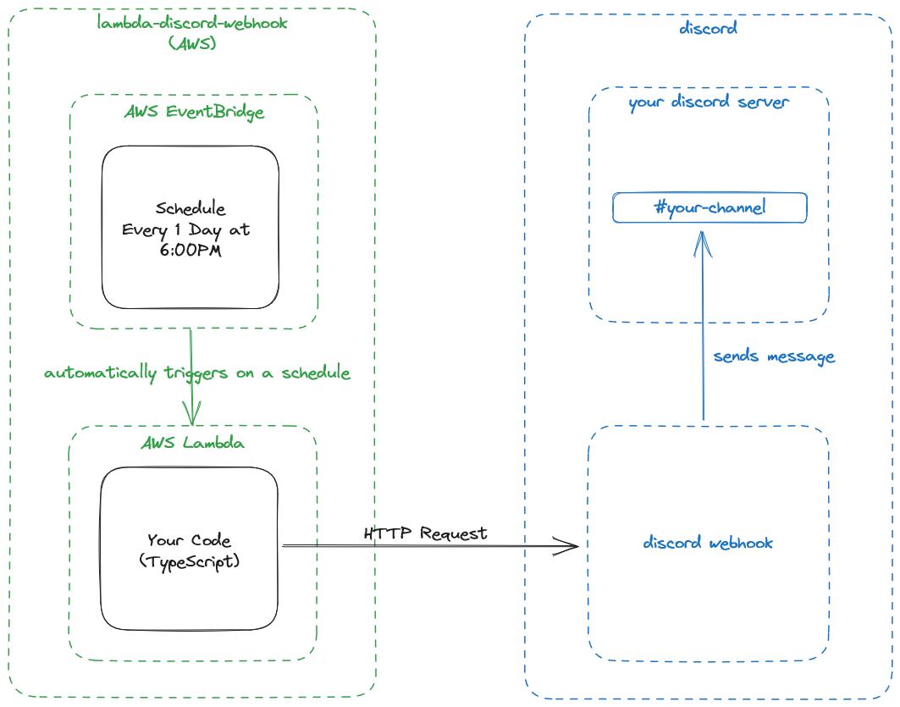

# lambda-discord-webhook

Simple template for setting up a scheduled lambda function that triggers a discord webhook to send a message.

Meant to be a starting point for someone to set up their own webhook triggered on a schedule.

## Summary
Use this repository as a starting place to automate discord messages. This package will help you set up the necessary AWS Infratructure to have a lambda triggered on a schedule that will call your code.

## Prerequisites
1. Install the [AWS CDK Toolkit](https://docs.aws.amazon.com/cdk/v2/guide/cli.html)
    - You will also need Docker installed and running locally
    - Make sure to follow the instructions to get credentials set up
2. Have your choice of npm/yarn installed

## Getting started
1. Create a webhook to call in Discord by following [these instructions](https://support.discord.com/hc/en-us/articles/228383668-Intro-to-Webhooks).
2. Fork this repository and pull locally
3. Create a `.env` file (using `.env.example` as an example). Use the URL from the webhook's "Copy Webhook URL" button on discord for `DISCORD_WEBHOOK_URL`.
4. Run `npm run build` to ensure everything works
5. Run `cdk deploy` to deploy!
   - You'll want ot re-run this any time you update your lambda's code

## Architecture
This package utilizies [AWS CDK](https://aws.amazon.com/cdk/), a tool which is used to set up AWS Infrastucture using code.
1. Set up an AWS Lambda defined in TypeScript.
2. Set up an AWS EventBridge rule that is triggered on a schedule. The schedule is defined in [cron](https://en.wikipedia.org/wiki/Cron) but other schedules can be used as well. The target of this rule is the Lambda function.

## CDK commands

- `npm run build` compile typescript to js
- `npm run watch` watch for changes and compile
- `npm run test` perform the jest unit tests
- `cdk deploy` deploy this stack to your default AWS account/region
- `cdk diff` compare deployed stack with current state
- `cdk synth` emits the synthesized CloudFormation template
